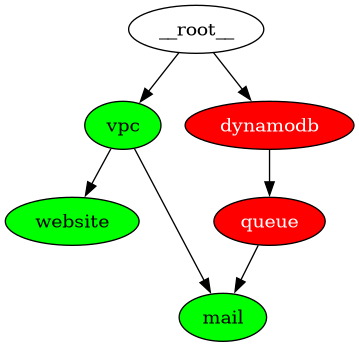

Partial-DAG Deployment and Visualization for Terramate/Terraform
================================================================

This is an example project that uses five stacks: ``vpc``, ``website``,
``dynamodb``, ``mail``, and ``queue``.  The stacks themselves do uninteresting
things.  But they have dependencies on each other that are specified via
Terramate's ``after`` speficier.  This controls its run ordering.

The tags of a stack's dependencies are specified in the ``after`` specifier
within that stack's ``stack.tm.hcl``.  For example. the ``website`` stack's
``stack.tm.hcl`` might have a ``stack`` block that looks like this:

.. code-block:: hcl

     stack {
       name        = "website"
       description = "website"
       id          = "f5f1711a-f854-439b-a0f9-d08a2e4d7f71"
       tags = [ "website" ]
       after = [ "tag:vpc" ]
     }

And the ``vpc`` stack's ``stack.tm.hcl`` might look like this:

.. code-block:: hcl

     stack {
       name        = "vpc"
       description = "vpc"
       id          = "daadbae0-240b-4cea-ba23-5b79ba080751"
       tags = [ "vpc" ]
     }

We use tags to specify dependency ordering because directory nesting is often
not sufficient to use when the DAG of dependencies gets complicated enough
(some stacks have more than one parent).  Therefore, we put all stacks in the
same directory, and we don't nest any, and form a dependency graph via
``after`` specifications.

In order to share a stack's remote state with its dependencies, we make use of
a ``global`` stanza in each dependent stack's ``stack.tm.hcl``.  For example,
in ``website/stack.tm.hcl``:

.. code-block:: hcl

    globals "dependencies" {
      vpc = null
    }

This spells out that ``website`` needs remote state from ``vpc``.  The sharing
of the remote state is done via ``dependencies.tml.hcl`` in the root of this
project, which writes a ``dependencies.tf`` file to each stack that has a
``depdencies`` global at generation time that points at the proper S3 bucket.
For example, when code generation is done against this project, a
``dependencies.tf`` will be generated in ``website/dependencies.tf`` that looks
something like:

.. code-block:: hcl

     data "terraform_remote_state" "vpc" {
       backend = "s3"
       config = {
         bucket  = "mcdonc-terramate-testing"
         encrypt = true
         key     = "terraform/states/by-id/daadbae0-240b-4cea-ba23-5b79ba080751/terraform.tfstate"
         region  = "us-east-1"
       }
       workspace = terraform.workspace
     }

     resource "null_resource" "retrieve-vpc-remote-state" {
       depends_on = [
         data.terraform_remote_state.vpc,
       ]
     }

The ``workspace`` value depends on the value of the ``vpc`` dependencies
global.  The global can either be ``null`` or a string.  If it is ``null``, the
workspace of the remote state depedndency is set to the workspace currently in
use at run time.  If it is a string, the remote state dependency will point at
the workspace specified by the string.

You might note that we are keeping two separate dependency graphs, one via
``after``, and one via the ``dependencies`` global.  The former is the run
order, and the latter is used to create a remote_state dependency chain.
Usually, they are the same, but if we must depend on remote state that isn't in
another stack set, they will differ.

We can use ``deploy.py graph`` to show a graph of the dependencies between the
stacks, which implies the order the stacks must be run in:

For example, in this graph, we must deploy ``vpc`` and ``dynamodb`` first, and
then their transitive dependencies in their graph order.

The ``deploy.py apply`` command will do that for us.

This is equivalent to using ``terramate run -X -- terraform apply``.

``deploy.py destroy`` will destroy all of the AWS resources that ``apply``
creates; it will run the graph in its reverse order to do so.

This is equivalent to using ``terrmate run --reverse -X -- terraform destroy``.

We can also omit nodes in the graph using ``deploy.py``.

``deploy.py apply --omit=dynamodb`` will run the terraform for each node in the
entire graph except ``dynamodb``.

``deploy.py apply --omit-=dynamodb --omit=queue`` will omit both ``dynamodb``
and ``queue``.

We can use ``deploy.py graph --omit=dynamodb --omit=queue`` to see what will
happen when we try to deploy.

The nodes in the graph that are red will not be deployed.

We can also prune a part of the graph out.  For example, if we don't want to
deploy ``dynamodb`` or anything that depends on it, can use
``deploy.py apply --prune=dynamodb``.

We can see what will happen before we try that by using
``deploy.py graph --prune=dynamodb``.  Because we pruned out everything
in the stack that depends on ``dynamodb`` (and ``dynamodb`` itself), we are
left with a graph consisting of only ``vpc`` and ``website``.

We can specify nodes in the graph from which a deployment should start by using
the ``--stack`` option.  Here is the result of
``deploy.py graph --stack=mail``.

Note that only ``mail`` and its dependencies are considered.

We can combine --stack, --omit, and --prune options to deploy only the pieces
of the graph that are relevant to what we're trying to do.  When using
``apply`` or ``destroy``, they will always be run in the correct order.

We can use the ``--workspace`` option to specify the workspace in which the
stacks will be run.  For example, ``deploy.py apply --workspace=donjohnson``
will cause all the selected stacks to be put into the ``donjohnson`` workspace.

Each of ``apply`` and ``destroy`` always:

- Generate the terraform.

- Select the workspace for each stack.

- Initialize each stack.

- run ``terraform apply`` or ``terraform destroy`` against each stack.
